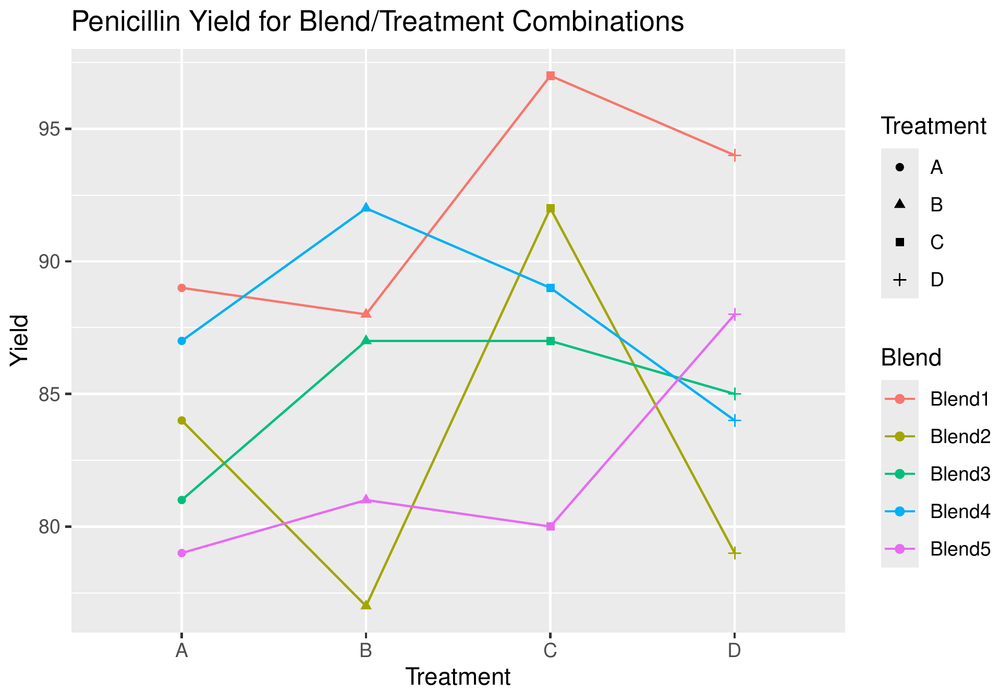
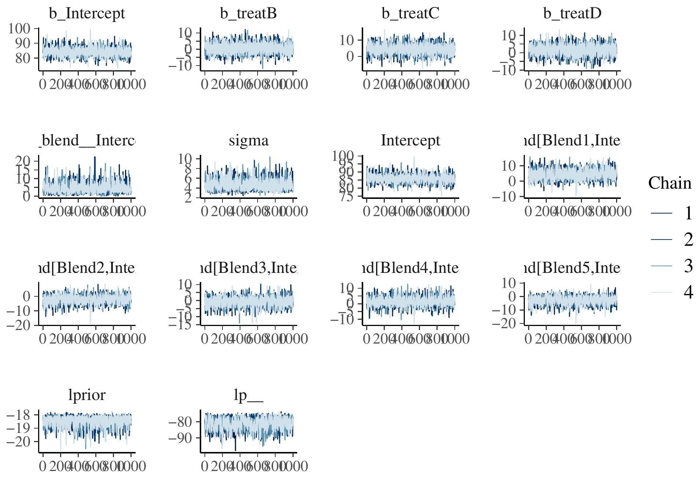
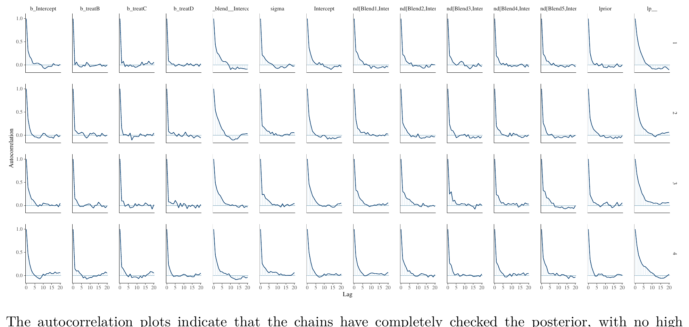
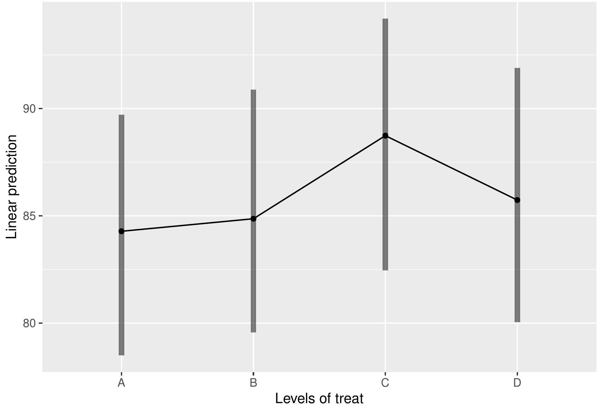
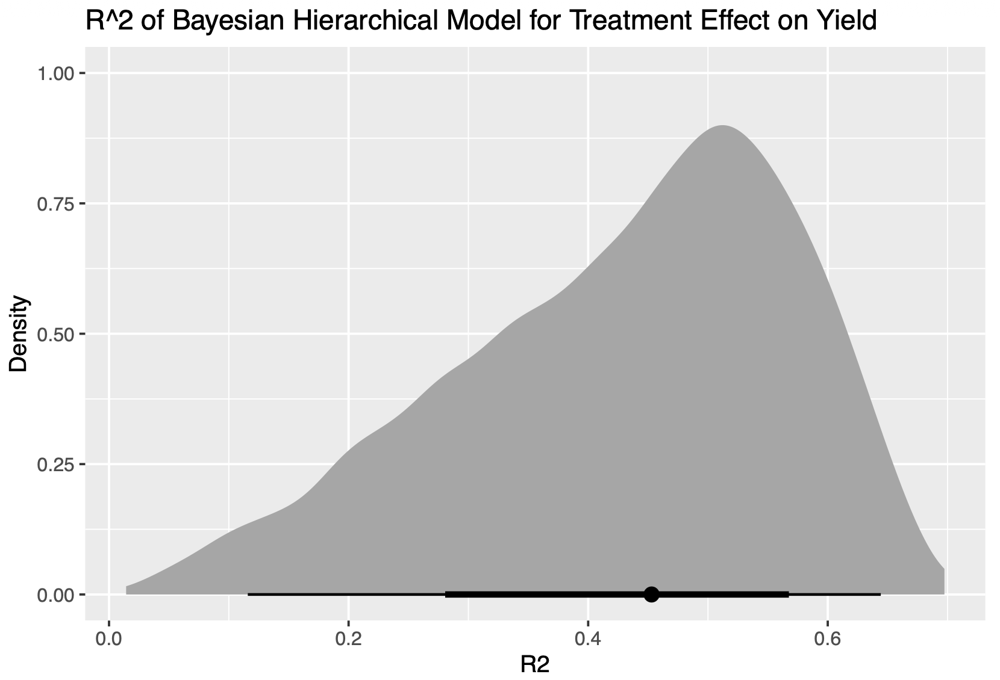
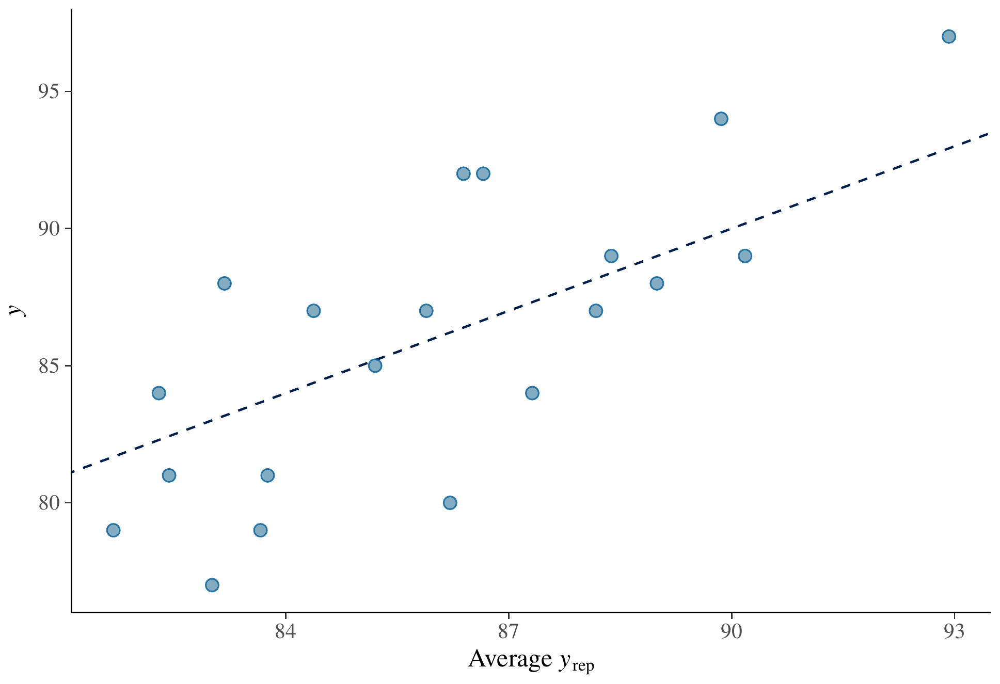
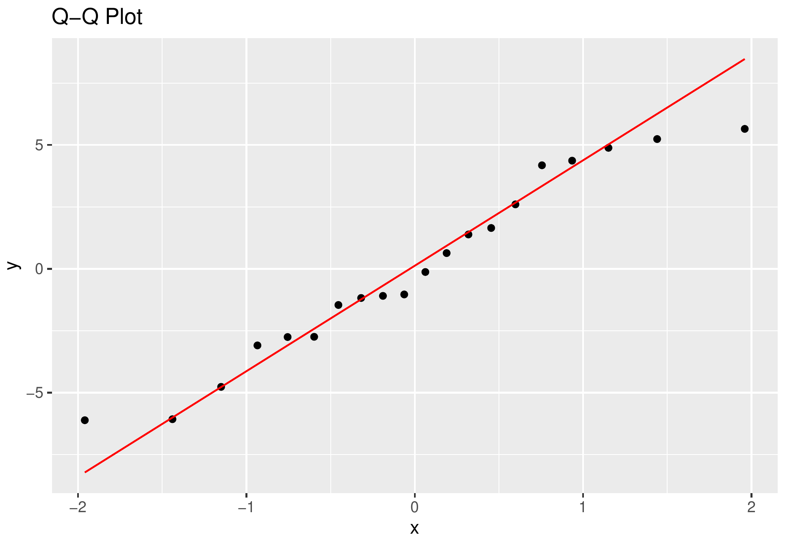
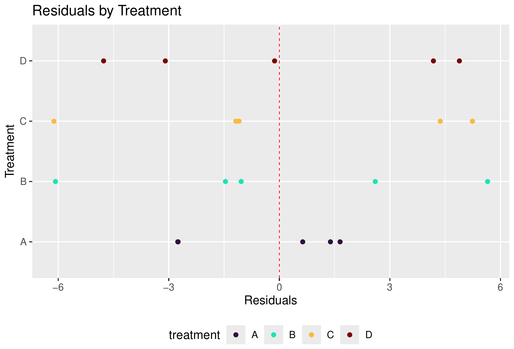

# 💡 Project Overview: A Bayesian Hierarchical Model for a Randomized Complete Block Design

This repository contains a coursework assignment for the **Bayesian Methods II** course of the Master's programme in Statistics & Data Science (Leiden University). The task: analyse a classic designed experiment on **penicillin production** with a fully Bayesian workflow. Penicillin yield depends on corn steep liquor, whose quality varies substantially between batches. To separate that nuisance variation from the effect of the production process, the experiment uses a **randomized complete block design (RCBD)**: 4 production processes (treatments A-D) are each run once within every one of 5 liquor blends (blocks). The analysis fits a **Bayesian hierarchical linear model** with `brms`, treating `treat` as a fixed effect and `blend` as a random effect, then works through convergence diagnostics, model checking, and inference on the treatment effects.

> **Assignment:** *Bayesian Methods II, Assignment 2*,
> submitted October 2024. The original instructions can be inspected in [BayII_assignment02_Infio.pdf](BayII_assignment02_Infio.pdf), and the full report can be read in
> [Bay2_assignment02.pdf](Bay2_assignment02.pdf). The rmarkdown report including the code for the analysis can be inspected at [Bay2_assignment02.Rmd](Bay2_assignment02.Rmd).

<br>

# 🔢 Data

The `penicillin` dataset from the `faraway` R package: 20 observations from a balanced RCBD.

| Variable | Description | Type |
|---|---|---|
| `yield` | penicillin yield (response) | continuous |
| `treat` | production process A, B, C, D (fixed effect) | categorical, 4 levels |
| `blend` | corn steep liquor blend / block (random effect) | categorical, 5 levels |

Exploratory means confirm the visual pattern: treatment C has the highest average yield (89) versus A, B, D (84, 85, 86), and yields vary more between blends than the treatment differences suggest.

<br>

# 🛠️ Methods

## Model

A Bayesian hierarchical (mixed-effects) linear model with a cornerstone (treatment-contrast) parameterization for the treatments and a random intercept per blend:

$$
y_{ij} = \alpha + \alpha_j + b_i + \epsilon_{ij}, \quad b_i \sim N(0, \sigma_\mu), \quad \epsilon_{ij} \sim N(0, \sigma_\epsilon)
$$

for treatments j = A…D and blends i = 1…5. Treating `blend` as random is justified because the blends used are a sample from a notional population of all possible blends; no treatment-by-block interaction is assumed, consistent with the RCBD.

## Priors

The default `brms` flat priors on the treatment coefficients are non-informative and implausible for a bounded response, so weakly-informative priors were set instead:

- Intercept α: Normal(86, 10), centered near the mean yield
- Treatment contrasts α_j: Normal(0, 10), wide enough to capture the maximum ~5-unit mean difference
- Between-blend SD σ_μ: Student-t(3, 0, 10), truncated at 0
- Residual SD σ_ε: Exponential(1 / 5.43), centered on the sample standard deviation

## Fitting & checking

- Sampled with `brms` (NUTS, 4 chains) at `adapt_delta = 0.9`
- Convergence assessed via R̂, effective sample sizes, trace plots, and autocorrelation plots
- Fit summarized with Bayesian R², the intraclass correlation (ICC), posterior predictive checks, estimated marginal means (`emmeans`), and residual diagnostics

<br>

# 📊 Key findings (TLDR)

1. **The blends matter; the treatments do not (credibly).** The between-blend standard deviation is estimated at **4.35** with a 95% credible interval of [0.59, 11.03], well away from zero, while every treatment contrast has a 95% CI spanning 0 (e.g. treatment C: +4.45, CI [-1.34, 10.12])
2. **Chains converged cleanly:** R̂ = 1.00 for all parameters, large effective sample sizes, well-mixed trace plots, and no residual autocorrelation
3. **Modest explanatory power:** Bayesian R² ≈ **0.43**, so the model explains under half the variation in yield, and the ICC (blend ≈ 0.48) indicates block-to-block structure comparable to the residual noise
4. The Bayesian conclusion mirrors a frequentist ANOVA (significant blend differences, no treatment effect) but additionally treats block variability as a parameter with full posterior uncertainty rather than a fixed quantity

<br>
<br>

# 📈 Results in detail

## Exploratory data analysis

<p align="center">
  
  <br>
  <em>Penicillin yield for each blend/treatment combination.</em>
</p>

**Results:**
- Treatment C tends to sit above the others, while treatment A shows the least spread across blends
- Blend 1 yields highest on average and blend 5 lowest, with blend 2 the most variable across treatments
- The parallel-ish lines across treatments give little visual evidence of a treatment-by-block interaction, supporting the additive RCBD model

<br>

## Model fit and convergence

<p align="center">
  
  <br>
  <em>MCMC trace plots for the model parameters.</em>
</p>

<br>

<p align="center">
  
  <br>
  <em>Autocorrelation of the chains.</em>
</p>

**Results:**
- R̂ = 1.00 across all parameters with large bulk and tail ESS
- Trace plots show good mixing (no large jumps, no stagnation); autocorrelation decays quickly to zero
- Posterior estimates: intercept 84.31, σ_ε (residual) 4.70, σ_μ (between-blend) 4.35

<br>

## Treatment effects

<p align="center">
  
  <br>
  <em>Estimated marginal means per treatment with credible intervals.</em>
</p>

**Results:**
- Posterior treatment means rank C highest, consistent with the raw data
- Every pairwise difference has an HPD interval containing 0: there is no credible evidence that the production processes differ in yield
- This is the key inferential takeaway, and it aligns with Faraway's frequentist analysis of the same data

<br>

## Explained variance and posterior predictive checks

<p align="center">
  
  <br>
  <em>Posterior distribution of the Bayesian R².</em>
</p>

<br>

<p align="center">
  
  <br>
  <em>Posterior predictive check: predicted vs. observed yield, overall and grouped by treatment.</em>
</p>

**Results:**
- Bayesian R² ≈ 0.43: the model captures the broad trend across and within treatment groups but leaves large residual variance
- The ICC (blend ≈ 0.48) confirms substantial block structure, on par with the within-group noise
- Posterior predictive draws track the observed means but with wide residuals, reflecting the limited signal in only 20 observations

<br>

## Residual diagnostics

<p align="center">
  
  
  <br>
  <em>Left: normal Q-Q plot of residuals. Right: residuals by treatment group.</em>
</p>

**Results:**
- The Q-Q plot supports approximately normal residuals, and residuals vs. fitted show no systematic pattern
- Residual spread is noticeably smaller for treatment A than for B, C, and D, a mild hint of non-constant variance across treatments that the homoscedastic model does not capture

<br>

# 💡 What can we take away from this?

The Bayesian and frequentist analyses reach the same substantive conclusion, so the value here is not a different answer but a richer one. Instead of a single p-value on the block effect, the hierarchical model returns a full posterior for the between-blend standard deviation, honestly propagating the considerable uncertainty that comes with only 5 blends and 20 observations. The blends drive most of the structure in the data, and no production process stands out as credibly better once that block variability is accounted for. The modest R² and the treatment-dependent residual spread suggest natural extensions: a heteroscedastic model allowing a separate σ per treatment, or more data, would be the sensible next steps.

<br>

# 🛠️ Implementation details

## Project structure

```
Bayesian/
├── Bay2_assignment02.Rmd            # main analysis (R Markdown)
├── Bay2_assignment02.pdf            # knitted report (submitted)
└── BayII_assignment02_Infio.pdf     # assignment instructions
```

## Quickstart

```r
# required packages
install.packages(c("brms", "faraway", "tidyverse", "ggdist", "bayesplot",
                   "tidybayes", "emmeans", "performance", "viridis", "latex2exp"))

# knit the full analysis to PDF (compiles the Stan model on first run)
rmarkdown::render("Bay2_assignment02.Rmd")
```

The model is fit with `set.seed(12345678)` and 4 chains. `brms` compiles the model via Stan on the first run, which requires a working C++ toolchain (`rstan` / `cmdstanr`).

<br>

# Reference

Faraway, J. J. (2016). *Extending the Linear Model with R: Generalized Linear, Mixed Effects and Nonparametric Regression Models* (2nd ed.). Chapman & Hall/CRC. (Section 10.6, penicillin RCBD.)
