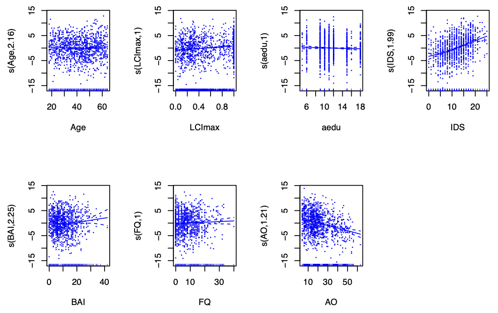
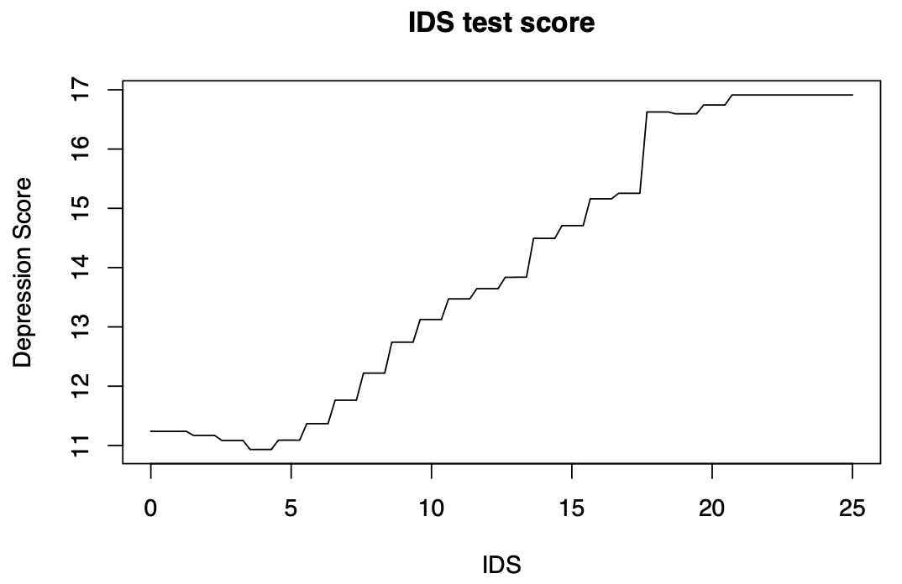
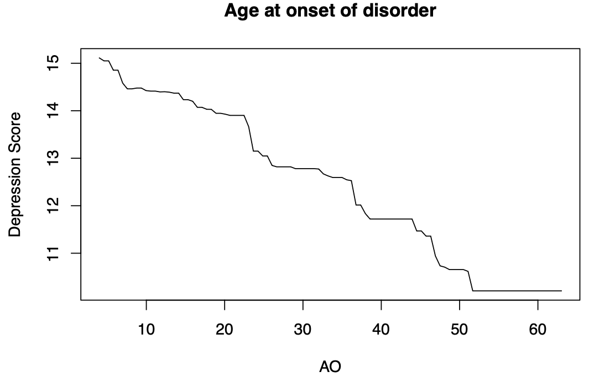
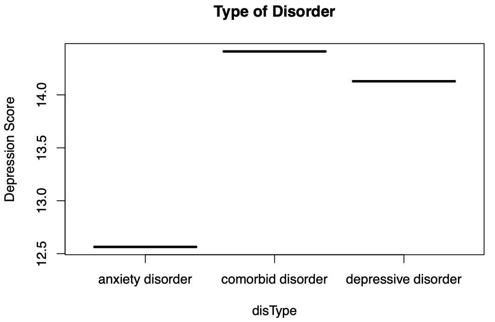
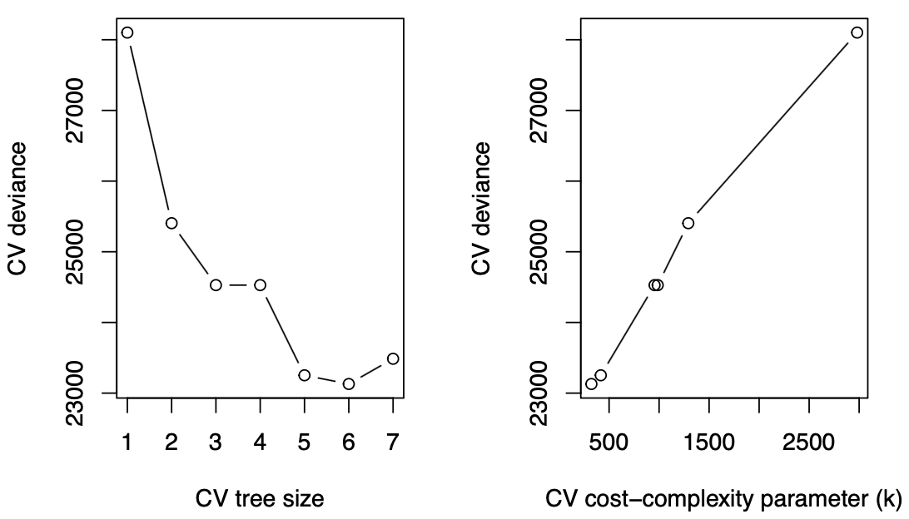
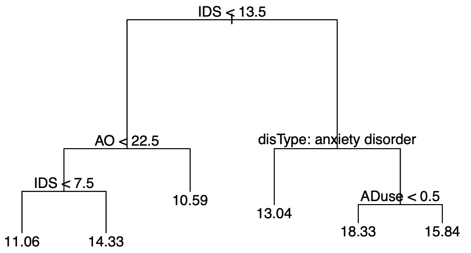

# 💡 Project Overview: Predicting Depression Severity using Machine Learning

This repository contains my second individual assignment for the **Statistical Learning** course of the Master's programme in Statistics & Data Science (Leiden University). The task: predict the **severity of depressive symptoms after 12 months** (`dep_sev_fu`) for patients with depression and/or anxiety disorders from a large epidemiological dataset of biopsychosocial predictors. Three supervised methods of increasing flexibility and decreasing interpretability are compared: a **single (pruned) regression tree**, a **Generalized Additive Model (GAM)**, and a **Gradient Boosting Machine (GBM)**. The fitted models are then used for a concrete clinical decision: should a new patient ("David") be referred to an intensive depression treatment program?

> **Assignment:** *Statistical Learning, Individual Assignment 2*,
> submitted May 2024. The original questions can be inspected in [Assignment 2.pdf](Assignment%202.pdf), and the full report can be read in
> [stat_learning_ind_assignment_02_JD.pdf](stat_learning_ind_assignment_02_JD.pdf). The full rmarkdown report including the code for the analyses can be inspected at [stat_learn_ind_assignment_02_JD.Rmd](stat_learn_ind_assignment_02_JD.Rmd).

<br>

# 🔢 Data

| Dataset | Description |
|---|---|
| `MHpredict.csv` | 1,500 patients, 20 predictors + continuous response `dep_sev_fu` (depression severity at 12-month follow-up). Split 1,000 train / 500 test |
| `Patient.csv` | A single new patient ("David") whose 12-month depression severity must be predicted for a treatment referral decision |

Predictors mix demographics (`Age`, `Sexe`, `aedu` education years), clinical measures (`IDS` Inventory of Depressive Symptomatology, `BAI` anxiety inventory, `FQ` fear questionnaire, `LCImax` % time symptomatic in past 4 years, `AO` age at disorder onset), diagnoses (`disType`, `bTypeDep`, `bSocPhob`, `bGAD`, `bPanic`, `bAgo`, `alcohol`, `pedigree`), and treatment status (`ADuse` antidepressants, `PsychTreat` psychological treatment, `RemDis`, `sample`).

<br>

# 🛠️ Methods

## Generalized Additive Model (GAM)

- Smoothing splines for all continuous predictors, parametric terms for all categorical ones (`mgcv`)
- Smoothness (effective df) selected automatically via **GCV / REML**, so no manual knot tuning is needed
- Keeps the additive structure of a linear model: each (possibly non-linear) effect remains separately interpretable

## Gradient Boosting Machine (GBM)

- Sequential ensemble of small trees, each fitted to the residuals of its predecessors
- Hyperparameters tuned by **10-fold cross-validation** (`caret`) over a grid of learning rate ∈ {0.1, 0.01, 0.001}, number of trees ∈ {10, …, 2500}, and interaction depth 1-4
- **Selected model: 1,000 trees, shrinkage 0.01, interaction depth 2**, min. 10 obs. per leaf
- Variable importance via normalized total gain; effect shapes via **partial dependence plots**

## Single (pruned) regression tree

- Fully grown CART (`tree`), then cost-complexity **pruning via cross-validation**
- Optimal subtree: **6 terminal splits** (cost-complexity k ≈ 323.2)
- Maximally interpretable, since the whole decision process fits in one plot, at the price of predictive power

<br>

# 📊 Key findings (TLDR)

**Test-set performance (500 held-out patients):**

| Model | Test MSE | Test R² |
|---|---|---|
| **GAM** | **18.26** | **26.4%** |
| GBM | 18.41 | 25.7% |
| Single pruned tree | 22.34 | 9.9% |

1. **GAM and GBM are statistically indistinguishable**: the bootstrapped 95% CI for their MSE difference contains zero, while both clearly beat the single tree
2. **The same predictors dominate across all three model families:** baseline IDS score, age at disorder onset, disorder type (comorbid > depressive > anxiety), and antidepressant use. This is a reassuring sign that the signal is real, not model-specific
3. Effect shapes are clinically plausible: higher baseline IDS and earlier disorder onset predict worse 12-month outcomes; antidepressant use and psychological treatment are associated with lower follow-up severity

**The clinical decision:** for patient David, the GAM predicts a 12-month severity of **17.7**, the GBM **17.4**, and the single tree **13.0** (see prediction intervals below). Two of three models, including the two best-performing ones, put him above the referral threshold. The recommendation is therefore to **refer David to the intensive treatment program**, while acknowledging the substantial uncertainty in the tree-based intervals.

<br>
<br>

# 📈 Results in detail

## GAM: estimated smooth effects

The GAM fits a separate smoothing spline per continuous predictor, so the shape of each effect can be inspected directly while all other predictors are held constant.

<p align="center">
  
  <br>
  <em>Estimated smooth effects of the continuous predictors on 12-month depression severity, with partial residuals.</em>
</p>

**Results:**
- **Age at disorder onset (AO)** shows the strongest association (F = 49.8, p < .00001): the later the disorder first appeared, the lower the follow-up severity. The effect is close to linear (edf ≈ 1)
- **Baseline IDS score** is strongly predictive (F ≈ 15) and clearly **non-linear** (edf ≈ 2), justifying the move beyond a plain linear model
- **% time symptomatic in the past 4 years (LCImax)** adds a modest, near-linear positive effect (F = 15.0, p < .001)
- Among the parametric terms: disorder type matters (F = 12.2, p < .0001; comorbid > depressive > anxiety), and both **antidepressant use** (F = 25.9) and **psychological treatment** (F = 15.4) are associated with *lower* follow-up severity

<br>

## GBM: hyperparameter tuning

The tuning grid crossed learning rate ∈ {0.1, 0.01, 0.001}, number of trees from 10 to 2,500, and interaction depth 1-4, evaluated by 10-fold cross-validated RMSE.

<p align="center">
  
  <br>
  <em>Cross-validated RMSE across the tuning grid. The minimum is reached at 1,000 trees, shrinkage 0.01, interaction depth 2.</em>
</p>

**Results:**
- The classic boosting trade-off is visible: the aggressive learning rate (0.1) overfits as trees accumulate, while the very conservative one (0.001) needs far more than 2,500 trees to converge
- **Shrinkage 0.01 with 1,000 trees and depth-2 trees** hits the sweet spot. Shallow interactions are enough for this data; deeper trees add variance, not signal

<br>

## GBM: variable importance & partial dependence

Variable importance aggregates each feature's loss reduction over every split it participates in (normalized total gain). The effect *shapes* of the top variables are then examined with partial dependence functions.

<p align="center">
  
  
  
  <br>
  <em>Partial dependence of predicted 12-month severity on baseline IDS score, age at onset, and disorder type.</em>
</p>

**Results:**
- **IDS dominates with 31.3% relative influence**, followed by age at onset (16.0%) and disorder type (12.7%)
- The IDS partial dependence rises steeply **above a score of ~16**: baseline symptom load is not just predictive, but predictive in an accelerating way
- Age at onset shows a monotone negative effect: early-onset patients face systematically worse 12-month outcomes
- Comorbid and depressive disorders predict higher severity than pure anxiety disorders, mirroring the GAM's parametric estimates

<br>

## Single regression tree: growing and pruning

The full tree was grown by recursive binary splitting on RSS, then pruned via cross-validated cost-complexity.

<p align="center">
  
  <br>
  <em>Cross-validated deviance against tree size and cost-complexity parameter k. The minimum sits at 6 terminal splits (k ≈ 323.2).</em>
</p>

<br>

<p align="center">
  
  <br>
  <em>The pruned tree: the entire decision process in one plot.</em>
</p>

**Results:**
- The tree independently selects the same variables as the ensembles: **IDS first** (root split), then **AO**, **disType**, and **ADuse**
- Interpretable rules fall out directly, e.g.: patients with IDS > 13.5 *and* an anxiety-type diagnosis *and* no antidepressant use get the highest predicted severity; patients with low IDS but onset before age 22.5 still land in an elevated-risk leaf
- The price of this readability shows up in the predictive accuracy: only 9.9% explained test variance

<br>

## Model comparison: bootstrapped confidence intervals

Pairwise MSE differences on the test set were bootstrapped (1,000 resamples, percentile 95% CIs):

| Comparison | 95% CI of MSE difference | Verdict |
|---|---|---|
| GAM − GBM | [-0.76, 0.42] | no reliable difference |
| GAM − tree | [-5.80, -2.30] | GAM clearly better |
| GBM − tree | [-5.45, -2.48] | GBM clearly better |

**Results:**
- The GAM's nominal lead over the GBM (MSE 18.26 vs. 18.41) is **not statistically distinguishable**: the interval comfortably contains zero
- Both flexible models beat the single tree by an amount that survives resampling uncertainty

<br>

## The referral decision: prediction intervals for David

| Model | Point prediction | 95% prediction interval |
|---|---|---|
| GAM | 17.7 | (16.3, 19.1) |
| GBM | 17.4 | (9.3, 25.5) |
| Single tree | 13.0 | (3.8, 22.3) |

**Results:**
- The GAM, the best-calibrated model, places David's interval almost entirely **above** the referral threshold
- The tree-based intervals are wide enough to span both decisions, reflecting those models' higher predictive variance
- Weighting models by their test performance, the recommendation is **referral**, communicated with explicit uncertainty. The point predictions alone would have overstated the confidence of that call

<br>

# 💡 What can we take away from this?

Model choice here is a trade-off between interpretability and accuracy, but the trade-off is not linear. The single tree gives up 16 percentage points of explained variance for its readability, while the GAM matches the boosted ensemble's accuracy *and* keeps every effect individually interpretable, making it arguably the best of both worlds for clinical communication. Equally important, uncertainty quantification changed the story: point predictions alone suggested a confident referral, but the bootstrap and prediction intervals revealed how much that confidence should be tempered. In applied prediction, and especially in medicine, reporting the interval is as important as reporting the estimate.

<br>

# 🛠️ Implementation details

## Project structure

```
02/
├── stat_learn_ind_assignment_02_JD.Rmd    # main analysis (R Markdown)
├── stat_learning_ind_assignment_02_JD.pdf # knitted report (submitted)
├── MHpredict.csv                          # 1,500 patients (train/test)
├── Patient.csv                            # new patient for the referral decision
└── Assignment 2.pdf                       # assignment instructions
```

## Quickstart

```r
# required packages
install.packages(c("mgcv", "caret", "gbm", "tree"))

# knit the full analysis to PDF
rmarkdown::render("stat_learn_ind_assignment_02_JD.Rmd")
```

All fits use `set.seed(4036018)`; the train/test split samples 500 test observations from the 1,500 patients. Note that the GBM grid search (10-fold CV × 60 parameter combinations) takes a while.

<br>

# Reference

James, G., Witten, D., Hastie, T., & Tibshirani, R. (2021).
*An Introduction to Statistical Learning with Applications in R* (2nd ed.). Springer.
