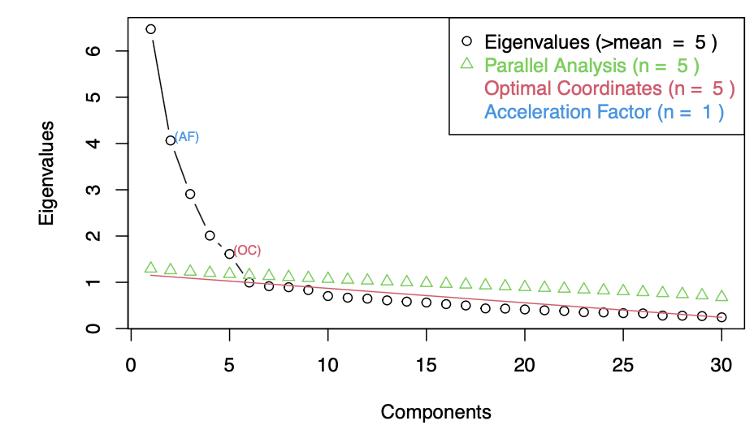
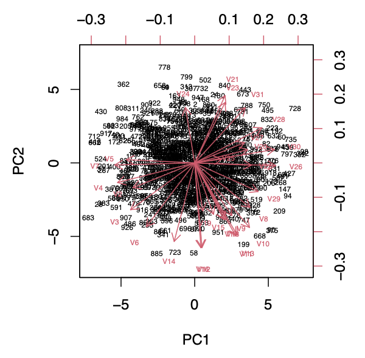
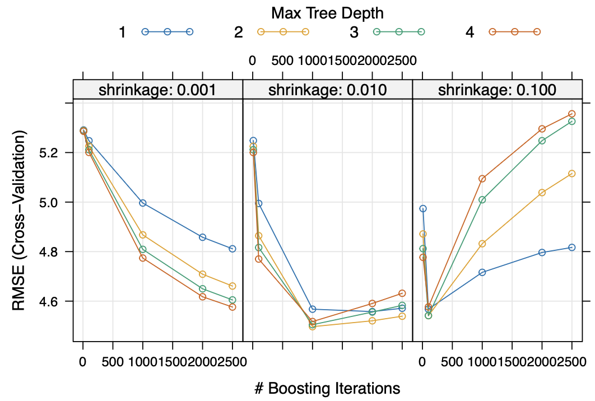

# leiden_public

A selection of projects from my master's in Statistics and Data Science at Leiden University. Please click on the highlighted project name to see more details.

 
 

## [Project 1.A](https://github.com/jshdmm/leiden_public/tree/main/ML/01): Machine Learning: Showcasing the bias-variance-trade-off, curse of dimensionality, and no-free lunch theorem (superised)

 

  
   
  <em></em>

 

## [Project 1.B](https://github.com/jshdmm/leiden_public/tree/main/ML/01): Machine Learning: Uncovering hidden personality traits (unsupervised)

 

  
   
  <em></em>

 

## [Project 2](https://github.com/jshdmm/leiden_public/tree/main/ML/02): Machine Learning: Using XGBoost, GAM and single regression trees to predict depression severity (supervised)

 

  
   
  <em></em>

 

## [Project 3](https://github.com/jshdmm/leiden_public/tree/main/causal_inference): Causal Inference: Isolating the causal effect of education on stroke risk
 

  
   
  <em></em>

 

## [Project 4](https://github.com/jshdmm/leiden_public/tree/main/Bayesian): Bayesian Statistics: Bayesian Hierarchical Modelling in Argriculture & Production Research

 

  
   
  <em>Penicillin yield for each blend/treatment combination.</em>

