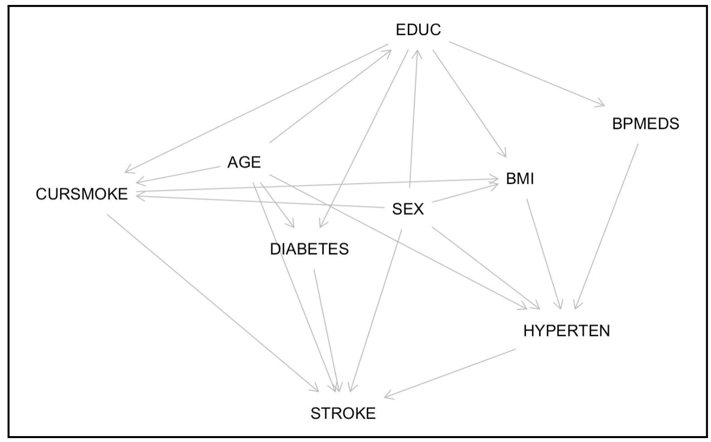
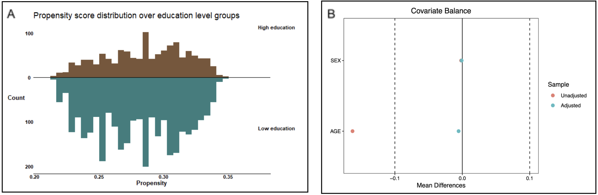

# 💡 Project Overview: Isolating the Causal Effect of Education on Stroke Risk

This repository contains our group assignment for the **Causal Inference** course of the Master's programme in Statistics & Data Science (Leiden University). The research question: does higher educational attainment *causally* reduce the risk of stroke? Earlier Framingham analyses (e.g. Garrison et al., 1993) reported an inverse *association* between education and cardiovascular disease, but association is not causation. Here the causal effect is isolated explicitly: causal assumptions are encoded in a **Directed Acyclic Graph (DAG)**, tested against the data, and the **Average Treatment Effect (ATE)** is estimated with **propensity score reweighting (IPW)** on a subset of the Framingham Heart Study.

> **Assignment:** *Causal Inference 1, Group Assignment*,
> submitted March 2025. The full report can be read in [CI_final_report.pdf](CI_final_report.pdf).
> The rmarkdown files including the code for the analyses can be inspected at
> [03_DAG.Rmd](03_DAG.Rmd) (DAG specification & testing), [04_outcome_regression.Rmd](04_outcome_regression.Rmd) (outcome regression & standardization), and [06_missingness.Rmd](06_missingness.Rmd) (missing data analysis).

<br>

# 🔗 Background

The **Framingham Heart Study** is a prospective cohort study on the etiology of cardiovascular disease, running since 1948. This analysis uses a teaching subset of N = 4434 participants included between 1956 and 1968 and followed for 24 years. Using potential outcome notation with Y the stroke outcome and X the education level, the target estimand is the risk difference

$$
\text{ATE} = E[Y(X{=}0)] - E[Y(X{=}1)]
$$

where X = 1 denotes college education or higher and X = 0 high school or lower. A positive ATE means higher education is protective.

<br>

# 🔢 Data

| Variable | Description | Values / range | Missing |
|---|---|---|---|
| `EDUC` | attained education (exposure) | 0: high school or lower (3,103) / 1: college or higher (1,218) | 113 |
| `STROKE` | stroke within 24-year follow-up (outcome) | 0: 4,019 / 1: 415 | 0 |
| `AGE` | age at baseline (confounder) | 32 - 70 years | 0 |
| `SEX` | participant sex (confounder) | 1,944 men / 2,490 women | 0 |
| `BMI` | body mass index (mediator) | 15.5 - 56.8 | 19 |
| `CURSMOKE` | current smoking (mediator) | 2,181 smokers | 0 |
| `BPMEDS` | antihypertensive medication (mediator) | 144 users | 61 |
| `DIABETES` | diabetic at baseline (mediator) | 121 diabetics | 0 |
| `HYPERTEN` | hypertension status (mediator) | 3,252 hypertensive | 0 |

4,242 of the 4,434 participants are complete cases; the analysis proceeds on complete cases after an explicit missingness investigation (see below).

<br>

# 🛠️ Methods

## Causal assumptions: the DAG

- Causal assumptions encoded with `dagitty`: education affects stroke risk via the mediators **BMI, blood pressure medication, smoking, and diabetes**, which act on stroke partly through **hypertension**; **age and sex** open backdoor paths as common causes
- The **backdoor criterion** (Pearl, 2009) identifies {AGE, SEX} as the sufficient adjustment set; mediators are deliberately *not* adjusted for, since they lie on the causal pathway

<p align="center">
  
  <br>
  <em>The adjusted DAG. Age and sex satisfy the backdoor criterion and form the adjustment set.</em>
</p>

## Testing the DAG against the data

- All **implied conditional independencies** of the DAG were derived via d-separation and tested as partial correlations (justified asymptotically for the mixed continuous/binary data), with **Holm-Bonferroni** correction
- Violated independencies were used to *revise* the DAG before estimation

## Propensity score reweighting (IPW)

- Propensity score e(x) = P(EDUC = 1 | AGE, SEX) estimated by logistic regression
- Weights wᵢ = 1/e(xᵢ) for the high-education group and wᵢ = 1/(1 - e(xᵢ)) for the low-education group
- Covariate balance assessed with **standardized mean differences (SMD)**, aiming for |SMD| < 0.1 after weighting; identification rests on **consistency, positivity, and conditional exchangeability**
- As a complementary approach, an **outcome regression with standardization** (`stdReg`) was fitted in [04_outcome_regression.Rmd](04_outcome_regression.Rmd)

## Missing data analysis

- Missingness patterns inspected with `mice::md.pattern`; a logistic regression of the missingness indicator P(EDUC missing | covariates) probes whether the mechanism is MCAR, MAR, or MNAR

<br>

# 📊 Key findings (TLDR)

1. **Higher education causally reduces stroke risk in this analysis:** estimated 24-year stroke risk is **9.87%** under low education vs. **7.78%** under high education, an ATE of **2.1 percentage points** with 95% CI [0.002, 0.040] that excludes zero
2. **The initial DAG was refuted in part by the data:** three implied conditional independencies failed testing, all involving smoking. The DAG was revised accordingly, and the adjustment set {AGE, SEX} remained valid
3. **IPW achieved covariate balance:** age was imbalanced before weighting (SMD = -.163) and well balanced after (-.006), with strong propensity score overlap between groups
4. **Missingness is benign:** only BMI weakly predicts missing education status (OR ≈ 1.06), a difference of ~1 BMI unit with no practical relevance, so the complete-case analysis carries minimal bias risk

<br>
<br>

# 📈 Results in detail

## Testing the DAG: three refuted independencies

After Holm-Bonferroni correction, three implied conditional independencies showed significantly non-zero partial correlations, all involving current smoking status: smoking and BMI (r = -.17, p < .001), smoking and sex (r = -.20, p < .001), and smoking and age (r = -.21, p < .001).

**Results:**
- All three violations are substantively plausible: men smoke more than women, younger participants smoke more, and smoking suppresses appetite and raises metabolism, lowering BMI
- The DAG was revised by adding the edges SEX → CURSMOKE, AGE → CURSMOKE, and CURSMOKE → BMI
- Crucially, the revised DAG implies **no new backdoor paths**: {AGE, SEX} remains the sufficient adjustment set, so the estimation strategy survives the model revision

<br>

## Propensity scores: overlap and balance

<p align="center">
  
  <br>
  <em>Left: propensity score distributions per education group show strong overlap (positivity). Right: standardized mean differences before and after IPW; dashed lines mark the 0.1 balance threshold.</em>
</p>

**Results:**
- Age predicts education (β = -.019, z = -4.69, p < .001); sex does not (p = .966)
- Propensity scores span 0.211 - 0.353 (low education) and 0.214 - 0.349 (high education): near-complete overlap, so **positivity holds comfortably**
- After weighting, both confounders are balanced (age SMD: -.163 → -.006; sex: -.002 → -.001), with minimal loss of effective sample size (3,045 → 3,038 and 1,196 → 1,180)

<br>

## The causal effect estimate

| Quantity | Estimate | 95% CI |
|---|---|---|
| Stroke risk, low education E[Y(X = 0)] | 9.87% | [8.89, 10.92] |
| Stroke risk, high education E[Y(X = 1)] | 7.78% | [6.47, 7.97] |
| **ATE (risk difference)** | **0.021** | [0.002, 0.040] |

**Results:**
- The interval excludes zero: lower education carries a statistically significantly higher stroke risk after removing confounding by age and sex
- The magnitude is modest (2.1 percentage points over 24 years) but consistent with the hypothesized protective effect of education, operating through healthier lifestyle mediators (BMI, smoking, medication adherence)

<br>

## Missing data mechanism

Out of 4,434 participants, 192 are incomplete: 113 missing on the exposure `EDUC`, 61 on `BPMEDS`, 19 on `BMI`; outcome and confounders are fully observed.

**Results:**
- In the missingness regression, only BMI predicts a missing education status (OR ≈ 1.06 per BMI unit); a t-test confirms a small difference in BMI between observed (M = 25.81) and missing (M = 26.90) education groups (t(117.01) = -2.78, p < .01)
- Both group means fall in the same overweight category, so the violation of MCAR is statistically detectable but practically negligible
- Verdict: the data can be treated as approximately MCAR/MAR. Complete-case analysis is defensible, though multiple imputation is recommended as a robustness check in future work

<br>

# 💡 What can we take away from this?

Correlation studies on Framingham data reported the education-stroke association decades ago; the added value of the causal framework is making the assumptions *explicit and testable*. Encoding them in a DAG exposed three assumptions the data rejected, and the graph told us exactly how to revise the model and, importantly, that the revision left the adjustment set intact. The resulting estimate of a 2.1 percentage point risk reduction is modest but survives confounding adjustment, supporting a genuine protective effect of education. What remains open is the mechanism: education presumably acts through mediators like smoking, BMI, and medication adherence, and quantifying those pathway-specific effects (e.g. via mediation analysis) would be the natural next step for designing actual interventions.

<br>

# 🛠️ Implementation details

## Project structure

```
03/
├── 03_DAG.Rmd                          # DAG specification, identification, independence testing
├── 04_outcome_regression.Rmd           # outcome regression + standardization (stdReg)
├── 06_missingness.Rmd                  # missing data mechanism analysis
├── CI_final_report.pdf                 # final report (submitted)
├── CI_DAG_assignment.drawio            # editable DAG diagram
├── 2025_framingham_assignment.csv      # Framingham teaching subset (4,434 participants)
├── Group 11 Assignment Causal Inference 1.docx  # report manuscript
└── Assignment tasks per week.docx      # assignment instructions
```

## Quickstart

```r
# required packages
install.packages(c("dagitty", "dplyr", "mice", "stdReg", "cobalt", "survey", "car", "ggplot2"))

# run the analyses in order
rmarkdown::render("03_DAG.Rmd")                 # DAG + conditional independence tests
rmarkdown::render("04_outcome_regression.Rmd")  # outcome regression + ATE via standardization
rmarkdown::render("06_missingness.Rmd")         # missingness mechanism
```

Analyses were performed with R version 4.3.3 or later.

<br>

# References

Freund, K. M., Belanger, A. J., D'Agostino, R. B., & Kannel, W. B. (1993). The health risks of smoking. The Framingham Study: 34 years of follow-up. *Annals of Epidemiology*, 3(4), 417-424.

Garrison, R. J., Gold, R. S., Wilson, P. W., & Kannel, W. B. (1993). Educational attainment and coronary heart disease risk: the Framingham Offspring Study. *Preventive Medicine*, 22(1), 54-64.

Latvala, A., Rose, R. J., Pulkkinen, L., Dick, D. M., Korhonen, T., & Kaprio, J. (2014). Drinking, smoking, and educational achievement: cross-lagged associations from adolescence to adulthood. *Drug and Alcohol Dependence*, 137, 106-113.

Mahmood, S. S., Levy, D., Vasan, R. S., & Wang, T. J. (2014). The Framingham Heart Study and the epidemiology of cardiovascular disease: a historical perspective. *The Lancet*, 383(9921), 999-1008.

Pearl, J. (2009). *Causality* (2nd ed.). Cambridge University Press.
